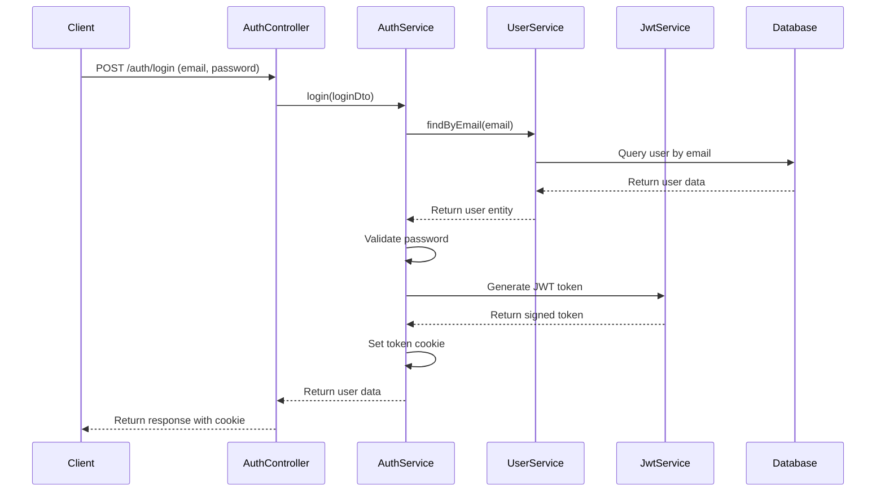
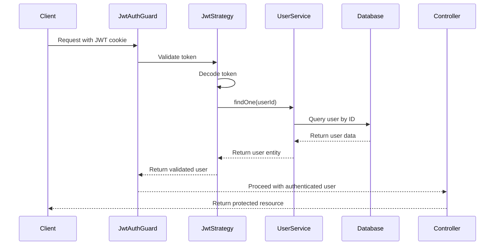
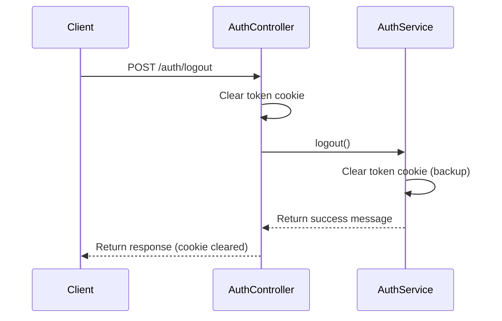

# Authentication Flow Diagram

This diagram illustrates the authentication flow in the Task Management System.

## Login Flow

```mermaid
sequenceDiagram
    participant Client
    participant AuthController
    participant AuthService
    participant UserService
    participant JwtService
    participant Database

    Client->>AuthController: POST /auth/login (email, password)
    AuthController->>AuthService: login(loginDto)
    AuthService->>UserService: findByEmail(email)
    UserService->>Database: Query user by email
    Database-->>UserService: Return user data
    UserService-->>AuthService: Return user entity
    AuthService->>AuthService: Validate password
    AuthService->>JwtService: Generate JWT token
    JwtService-->>AuthService: Return signed token
    AuthService->>AuthService: Set token cookie
    AuthService-->>AuthController: Return user data
    AuthController-->>Client: Return response with cookie
```

## Authentication Verification Flow

```mermaid
sequenceDiagram
    participant Client
    participant JwtAuthGuard
    participant JwtStrategy
    participant UserService
    participant Database
    participant Controller

    Client->>JwtAuthGuard: Request with JWT cookie
    JwtAuthGuard->>JwtStrategy: Validate token
    JwtStrategy->>JwtStrategy: Decode token
    JwtStrategy->>UserService: findOne(userId)
    UserService->>Database: Query user by ID
    Database-->>UserService: Return user data
    UserService-->>JwtStrategy: Return user entity
    JwtStrategy-->>JwtAuthGuard: Return validated user
    JwtAuthGuard-->>Controller: Proceed with authenticated user
    Controller-->>Client: Return protected resource
```

## Logout Flow

```mermaid
sequenceDiagram
    participant Client
    participant AuthController
    participant AuthService
    
    Client->>AuthController: POST /auth/logout
    AuthController->>AuthController: Clear token cookie
    AuthController->>AuthService: logout()
    AuthService->>AuthService: Clear token cookie (backup)
    AuthService-->>AuthController: Return success message
    AuthController-->>Client: Return response (cookie cleared)
```
