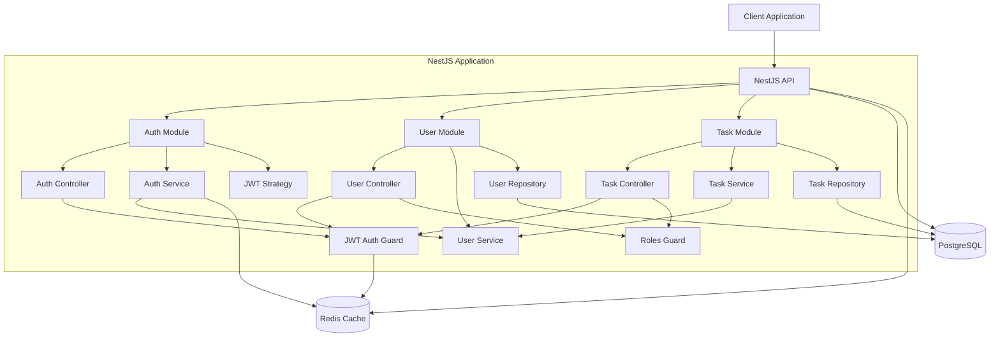
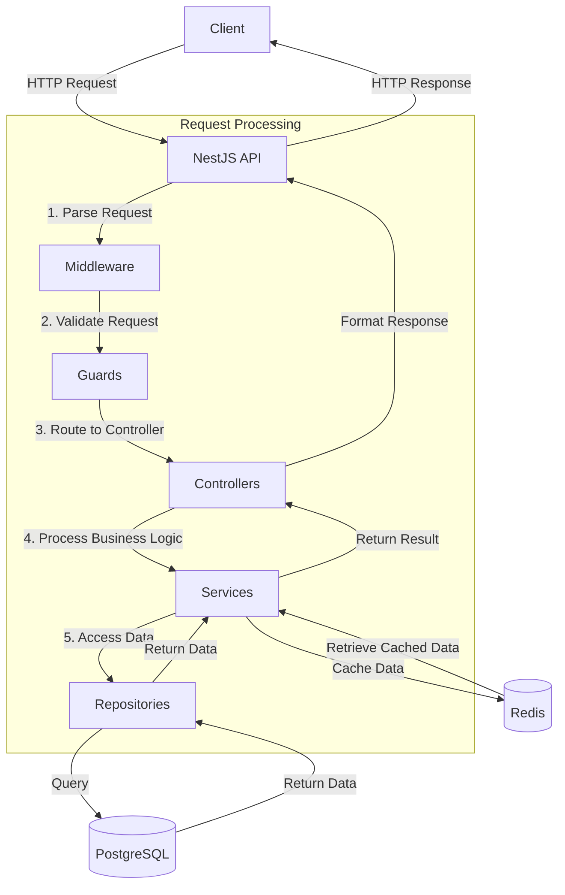
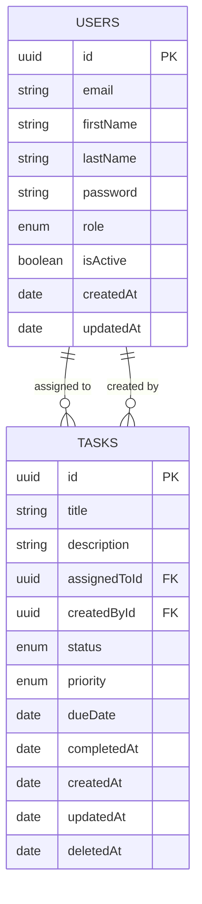

# System Architecture Diagram

This document illustrates the overall architecture of the Task Management System.

## Component Architecture

```mermaid
graph TD
    Client[Client Application] --> API[NestJS API]
    
    subgraph "NestJS Application"
        API --> AuthModule[Auth Module]
        API --> UserModule[User Module]
        API --> TaskModule[Task Module]
        
        AuthModule --> AuthController[Auth Controller]
        AuthModule --> AuthService[Auth Service]
        AuthModule --> JwtStrategy[JWT Strategy]
        
        UserModule --> UserController[User Controller]
        UserModule --> UserService[User Service]
        UserModule --> UserRepository[User Repository]
        
        TaskModule --> TaskController[Task Controller]
        TaskModule --> TaskService[Task Service]
        TaskModule --> TaskRepository[Task Repository]
        
        AuthService --> UserService
        TaskService --> UserService
        
        AuthController --> JwtAuthGuard[JWT Auth Guard]
        UserController --> JwtAuthGuard
        TaskController --> JwtAuthGuard
        
        UserController --> RolesGuard[Roles Guard]
        TaskController --> RolesGuard
    end
    
    API --> PostgreSQL[(PostgreSQL)]
    API --> Redis[(Redis Cache)]
    
    UserRepository --> PostgreSQL
    TaskRepository --> PostgreSQL
    
    AuthService --> Redis
    JwtAuthGuard --> Redis
```

## Data Flow Architecture

```mermaid
flowchart TD
    Client[Client] --> |HTTP Request| API[NestJS API]
    
    subgraph "Request Processing"
        API --> |1. Parse Request| Middleware[Middleware]
        Middleware --> |2. Validate Request| Guards[Guards]
        Guards --> |3. Route to Controller| Controllers[Controllers]
        Controllers --> |4. Process Business Logic| Services[Services]
        Services --> |5. Access Data| Repositories[Repositories]
    end
    
    Repositories --> |Query| Database[(PostgreSQL)]
    Database --> |Return Data| Repositories
    
    Services --> |Cache Data| Cache[(Redis)]
    Cache --> |Retrieve Cached Data| Services
    
    Repositories --> |Return Data| Services
    Services --> |Return Result| Controllers
    Controllers --> |Format Response| API
    API --> |HTTP Response| Client
```

## Database Schema

```mermaid
erDiagram
    USERS {
        uuid id PK
        string email
        string firstName
        string lastName
        string password
        enum role
        boolean isActive
        date createdAt
        date updatedAt
    }
    
    TASKS {
        uuid id PK
        string title
        string description
        uuid assignedToId FK
        uuid createdById FK
        enum status
        enum priority
        date dueDate
        date completedAt
        date createdAt
        date updatedAt
        date deletedAt
    }
    
    USERS ||--o{ TASKS : "assigned to"
    USERS ||--o{ TASKS : "created by"
```
