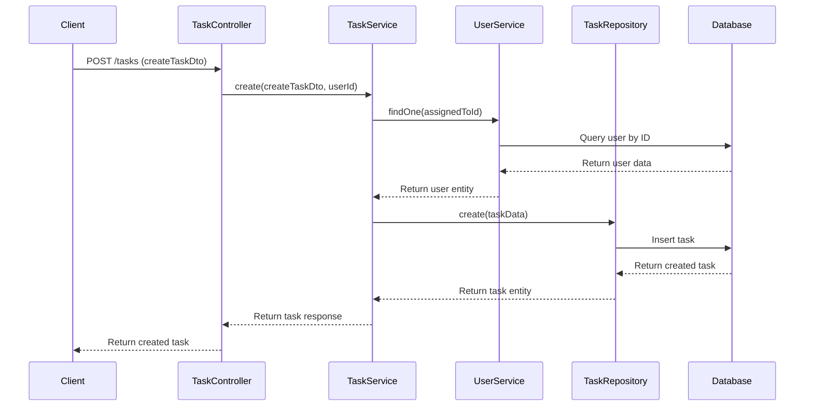
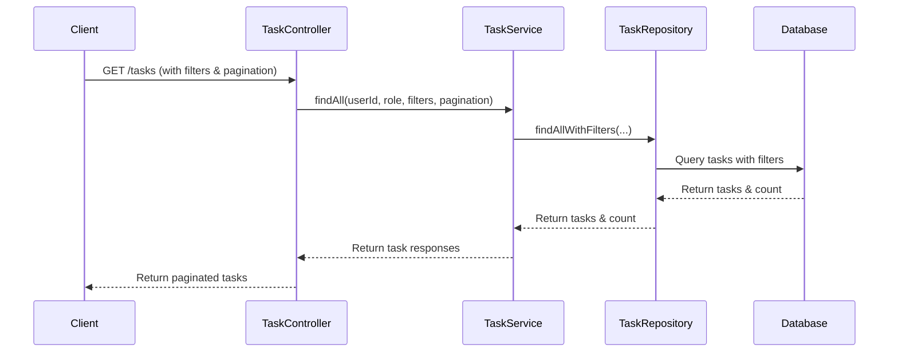
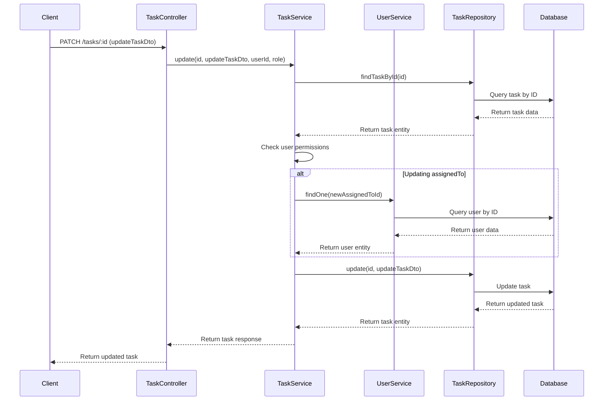
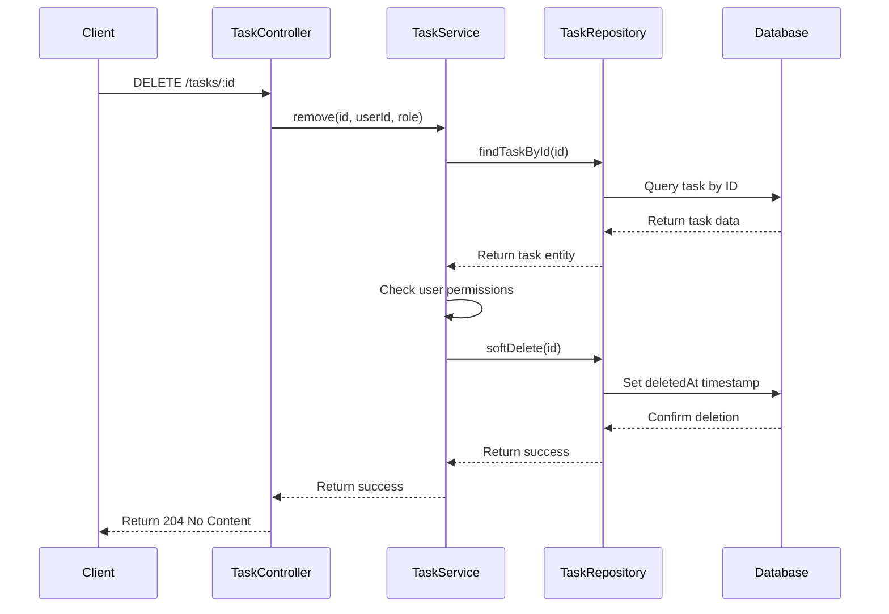

# Task Management Flow Diagrams

This document illustrates the key task management workflows in the system.

## Task Creation Flow

## Task Retrieval Flow

## Task Update Flow

## Task Deletion Flow (Soft Delete)

